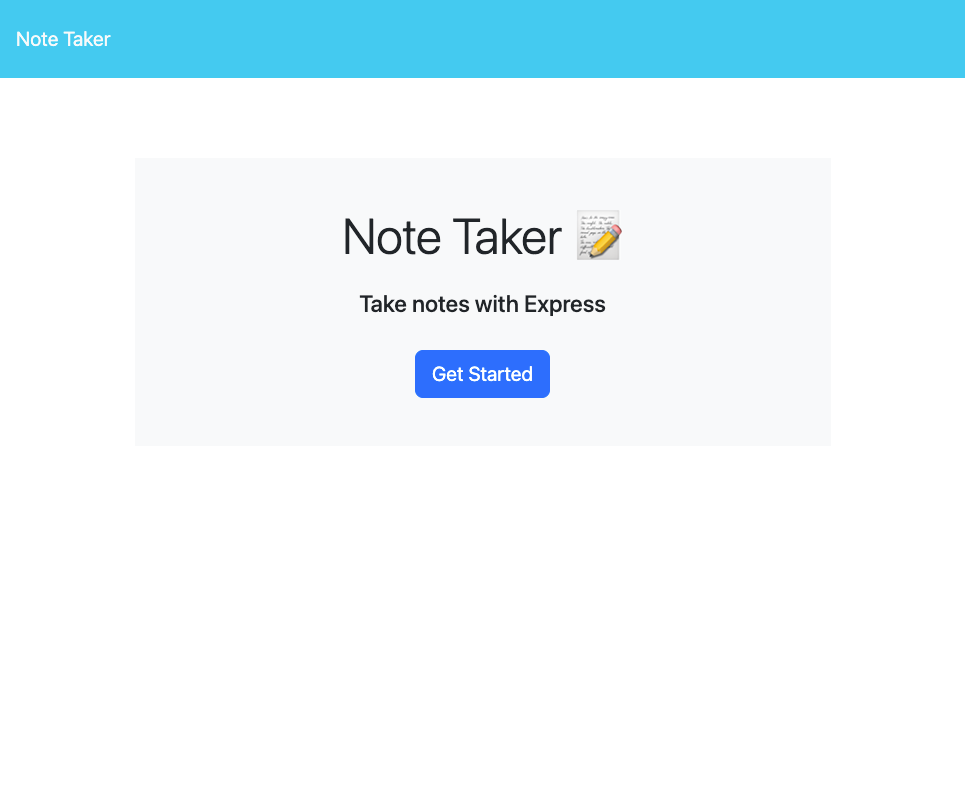
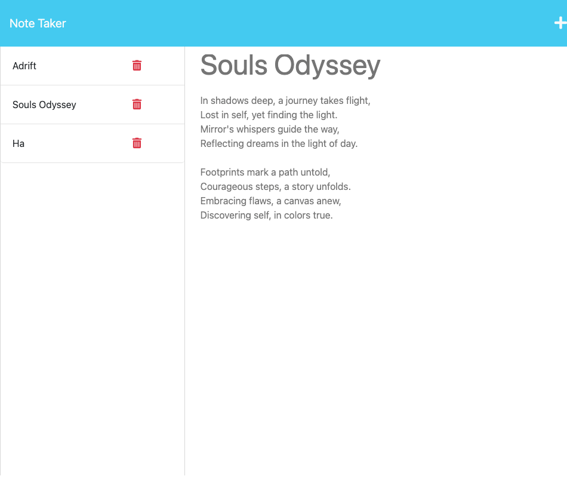

# Note-Taker 

## Description
An interface that enables users to generate, remove, and review their notes, showcasing a comprehensive collection of all previously created notes.

## Table of Contents
* [Installation](#installation)
* [Usage](#usage)
* [Testing](#testing)
* [Contributors](#contributors)
* [Questions](#questions)

## Installation
Clone repo => install dependencies | Check out the deployed application here: 

## Usage

The following images show the web application's appearance and functionality:

## Testing
None

## Contributors
None

## Questions
Please send your questions, https://github.com/coterone